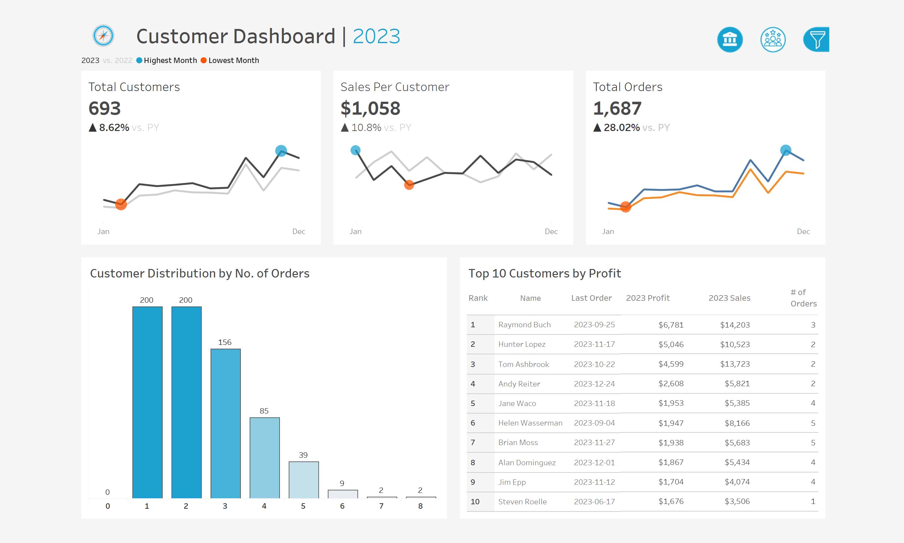
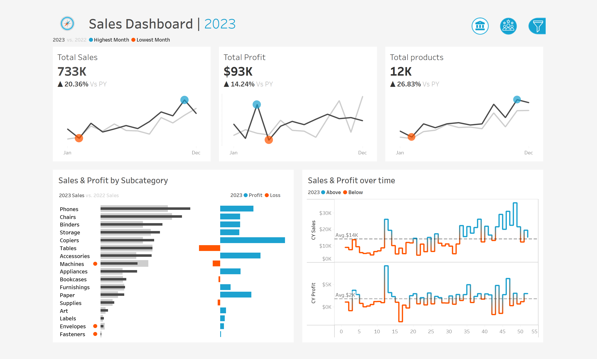

# 📊 Tableau Dashboard Project – Customer & Sales Analytics 2023

This repository contains two interactive dashboards created in **Tableau** to visualize and analyze **Customer Behavior** and **Sales Performance** for the year **2023**. These dashboards aim to help businesses gain actionable insights, improve decision-making, and track KPIs effectively.

## 🔍 Project Overview

The project includes:

### 1️⃣ **Customer Dashboard**
- **Total Customers**: 693  
- **Sales per Customer**: $1,058  
- **Total Orders**: 1,687  
- **Customer Distribution by No. of Orders**  
- **Top 10 Customers by Profit**  
- **Year-over-Year Comparison (2023 vs 2022)**

### 2️⃣ **Sales Dashboard**
- **Total Sales**: $733K  
- **Total Profit**: $93K  
- **Total Products Sold**: 12K  
- **Sales & Profit by Subcategory**  
- **Sales & Profit Trends Over Time**

📈 Both dashboards track KPIs across the year with highlights on the highest and lowest performing months.  

## 📂 Files Included

- `Customer1.png`: Customer Dashboard (2023)
- `Sales1.png`: Sales Dashboard (2023)
- `Dashboard.twbx`: Tableau Workbook file 
- `README.md`: Project documentation

## 🛠️ Tools & Technologies

- [Tableau Desktop](https://www.tableau.com/)
- Microsoft Excel (for data cleaning)
- Dummy dataset (can be adapted for real business use cases)

## 💡 Key Insights

- Identified top-performing customers by profit and sales.
- Analyzed sales trends by product subcategories.
- Visualized sales performance over time to detect patterns and anomalies.
- Compared year-over-year performance to monitor business growth.

## 📷 Dashboards Preview

### Customer Dashboard  

### Sales Dashboard  

## 🤝 Let's Connect!

If you found this project helpful or inspiring, feel free to star ⭐ the repository or reach out!

📬 [LinkedIn] (https://www.linkedin.com/in/sumit-chhillar-020a36323/)

## 📌 License

This project is for educational and demonstration purposes only.
